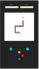

Cambiar a:&nbsp; &nbsp; 

---

# Portafolio
Este es un portafolio profesional con algunos de los projectos desarrollados por <a href="https://www.linkedin.com/in/mariangelicarodriguezperez/" target="_blank">Mariangelica Rodriguez</a>, dónde puedes visitar las webs, diseños de prototipos, mockups y repositorios de los diferentes proyectos.

 

# Proyectos:

&nbsp; &nbsp;  &nbsp; &nbsp;
  FullPokeApp:

 

 

### Descripción:
Aplicación web desarrollada en React.js, SASS y Nextui.

### funciones:
  - Juego de memoria.
  - Buscador.
  - Sección para crear Pokémones.

### Links del proyecto

<a href="https://github.com/Gromarant/fullPokeApp" title="visit FullPokeApp repository" target="_blank" style="display:flex; flex-wrapp; wrapp; gap:4px; justify-content:center; align-items:center; padding:8px 24px; border-radius:16px; background-color: #fcffff;color:#1e7b9d; font-weight:600;">Repositorio</a>
<a href="https://fullpokeapp.netlify.app" title="Go to FullPokeApp web app" target="_blank" style="display:flex; flex-wrapp; wrapp; gap:4px; justify-content:center; align-items:center;padding:8px 24px; border-radius:16px; background-color: #fcffff;color:#1e7b9d; font-weight:600;">Web</a>

 

---

&nbsp; &nbsp;  &nbsp; &nbsp;
  Groma-Snake:

 

 

### Descripción:
Juego desarrollado en HTML, CSS y JavaScript vanilla.

### funciones
  - Juego de la culebra.
  - Reiniciar el juego.
  - Ver Puntaje y score.

### Links del proyecto

<a href="https://www.figma.com/file/6SYeCJMoiDG8LZPKQ3QRyZ/GromaSnake?type=design&node-id=0-1&mode=design&t=taUbdkRK095LZ2Cp-0" title="visit FullPokeApp prototype" target="_blank" style="display:flex; flex-wrapp; wrapp; gap:4px; justify-content:center; align-items:center; padding:8px 24px; border-radius:16px; background-color: #fcffff;color:#1e7b9d; font-weight:600;">Prototype</a>
<a href="https://github.com/Gromarant/GromaSnake" title="visit Groma-Snake repository" target="_blank" style="display:flex; flex-wrapp; wrapp; gap:4px; justify-content:center; align-items:center; padding:8px 24px; border-radius:16px; background-color: #fcffff;color:#1e7b9d; font-weight:600;">Repository</a>
<a href="hhttps://gromarant.github.io/GromaSnake/" title="Go to Groma-Snake web app" target="_blank" style="display:flex; flex-wrapp; wrapp; gap:4px; justify-content:center; align-items:center; padding:8px 24px; border-radius:16px; background-color: #fcffff;color:#1e7b9d; font-weight:600;">Web</a>
<a href="https://www.youtube.com/watch?v=hwLYrtQhLVI" title="See Groma-Snake video" target="_blank" style="display:flex; flex-wrapp; wrapp; gap:4px; justify-content:center; align-items:center;padding:8px 24px; border-radius:16px; background-color: #fcffff;color:#1e7b9d; font-weight:600;">Video</a>

 

---