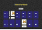
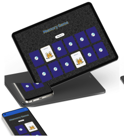
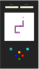
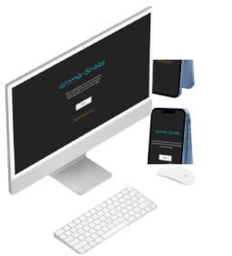
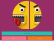

Change to:&nbsp; &nbsp; 

---

# Portfolio
This is a professional portfolio with some of the projects developed by <a href="https://www.linkedin.com/in/mariangelicarodriguezperez/" target="_blank">Mariangelica Rodriguez</a>, where you can visit links to websites, design of prototypes, mockups and repositories of different projects.

 

# Projects:

&nbsp; &nbsp;  &nbsp; &nbsp;
  FullPokeApp:

 

 

### Description:
Web application develop in React.js, SASS and Nextui.

### functions
  - Memory game
  - Search engine
  - Pokémon creation

### Project links

<a href="https://github.com/Gromarant/fullPokeApp" title="visit FullPokeApp repository" target="_blank" style="display:flex; flex-wrapp; wrapp; gap:4px; justify-content:center; align-items:center; padding:8px 24px; border-radius:16px; background-color: #fcffff;color:#1e7b9d; font-weight:600;">Repository</a>
<a href="https://fullpokeapp.netlify.app" title="Go to FullPokeApp web app" target="_blank" style="display:flex; flex-wrapp; wrapp; gap:4px; justify-content:center; align-items:center;padding:8px 24px; border-radius:16px; background-color: #fcffff;color:#1e7b9d; font-weight:600;">Web</a>

 

---

&nbsp; &nbsp;  &nbsp; &nbsp;
  Groma-Snake:

 

 

### Description:
Game develop in HTML, CSS and JavaScript.

### functions
  - Snake game
  - Reset game
  - See points and score

### Project links

<a href="https://www.figma.com/file/6SYeCJMoiDG8LZPKQ3QRyZ/GromaSnake?type=design&node-id=0-1&mode=design&t=taUbdkRK095LZ2Cp-0" title="visit FullPokeApp prototype" target="_blank" style="display:flex; flex-wrapp; wrapp; gap:4px; justify-content:center; align-items:center; padding:8px 24px; border-radius:16px; background-color: #fcffff;color:#1e7b9d; font-weight:600;">Prototype</a>
<a href="https://github.com/Gromarant/GromaSnake" title="visit Groma-Snake repository" target="_blank" style="display:flex; flex-wrapp; wrapp; gap:4px; justify-content:center; align-items:center; padding:8px 24px; border-radius:16px; background-color: #fcffff;color:#1e7b9d; font-weight:600;">Repository</a>
<a href="hhttps://gromarant.github.io/GromaSnake/" title="Go to Groma-Snake web app" target="_blank" style="display:flex; flex-wrapp; wrapp; gap:4px; justify-content:center; align-items:center; padding:8px 24px; border-radius:16px; background-color: #fcffff;color:#1e7b9d; font-weight:600;">Web</a>
<a href="https://www.youtube.com/watch?v=hwLYrtQhLVI" title="See Groma-Snake video" target="_blank" style="display:flex; flex-wrapp; wrapp; gap:4px; justify-content:center; align-items:center;padding:8px 24px; border-radius:16px; background-color: #fcffff;color:#1e7b9d; font-weight:600;">Video</a>

 

---

&nbsp; &nbsp;  &nbsp; &nbsp;
  FunFace:

 

 

### Description:
Static web page, build with HTML, CSS and JavaScript vanilla.

### functions
  - Display random emoji
  - Emoji selector

### Project links

<a href="https://www.figma.com/proto/fV01fBdBQbbT5fScqf7ro1/FunFace?page-id=15%3A772&node-id=15-933&viewport=758%2C109%2C0.05&scaling=scale-down&starting-point-node-id=15%3A1603" title="visit FunFace prototype" target="_blank" style="display:flex; flex-wrapp; wrapp; gap:4px; justify-content:center; align-items:center; padding:8px 24px; border-radius:16px; background-color: #fcffff;color:#1e7b9d; font-weight:600;">Prototype</a>
<a href="https://github.com/Gromarant/FunFace" title="visit FunFace repository" target="_blank" style="display:flex; flex-wrapp; wrapp; gap:4px; justify-content:center; align-items:center; padding:8px 24px; border-radius:16px; background-color: #fcffff;color:#1e7b9d; font-weight:600;">Repository</a>
<a href="https://gromarant.github.io/FunFace/" title="Go to FunFace web app" target="_blank" style="display:flex; flex-wrapp; wrapp; gap:4px; justify-content:center; align-items:center; padding:8px 24px; border-radius:16px; background-color: #fcffff;color:#1e7b9d; font-weight:600;">Web</a>

 

---

  Robopage:

 
Project image/Banner
 

 

### Description:
xxx

### functions
  - xxxxxxxxx
  - xxxxxxxxx

Project links

<a href="https://fullpokeapp.netlify.app" target="_blank">Visit app</a>

---

  Gromarant Portfolio:

 
Project image/Banner
 

 

### Description:
xxx

### functions
  - xxxxxxxxx
  - xxxxxxxxx

Project links

<a href="https://fullpokeapp.netlify.app" target="_blank">Visit app</a>

---

 

© Mariangelica Rodriguez

<a href="https://www.linkedin.com/in/mariangelicarodriguezperez/">

</a>
<a href="https://github.com/Gromarant">

</a>