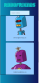
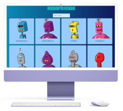
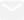

Change to:&nbsp; &nbsp; 

---

# Portfolio
This is a professional portfolio with some of the projects developed by <a href="https://www.linkedin.com/in/mariangelicarodriguezperez/" target="_blank">Mariangelica Rodriguez</a>, where you can visit links to websites, design of prototypes, mockups and repositories of different projects.

 

# Projects:

&nbsp; &nbsp;  &nbsp; &nbsp;
  FullPokeApp:

 

 

### Description:
Web application develop in React.js, SASS and Nextui.

### functions:
  - Memory game
  - Search engine
  - Pokémon creation

### Project links:

 &nbsp; &nbsp;

 

---

&nbsp; &nbsp;  &nbsp; &nbsp;
  Groma-Snake:

 

 

### Description:
Game develop in HTML, CSS and JavaScript.

### functions:
  - Snake game
  - Reset game
  - See points and score

### Project links:

 &nbsp; &nbsp;
 &nbsp; &nbsp;
 &nbsp; &nbsp;

 

---

&nbsp; &nbsp;  &nbsp; &nbsp;
  FunFace:

 

 

### Description:
Static web page, build with HTML, CSS and JavaScript vanilla.

### functions:
  - Display random emoji
  - Emoji selector

### Project links:

 &nbsp; &nbsp;
 &nbsp; &nbsp;

 

---

&nbsp; &nbsp;  &nbsp; &nbsp;
  Robopage:

 

 

### Description:
React web app.

### functions:
  - Search engine with API fetch data.

### Project links:

 &nbsp; &nbsp;

 

---

 

© Mariangelica Rodriguez

 &nbsp; &nbsp;
 &nbsp; &nbsp;

  

